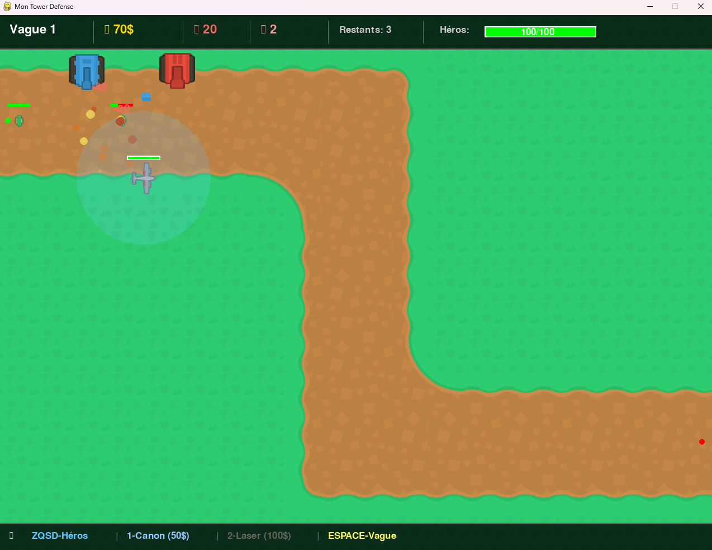

# Tower Defense Game



Un jeu de type **Tower Defense** développé en Python avec **Pygame** et **Pytmx**. Le joueur doit défendre sa base en plaçant des tours pour empêcher les monstres d'atteindre la sortie. Le jeu inclut un héros contrôlable, des vagues de monstres, des effets visuels, et un système de score.

## 📌 Fonctionnalités

- **Placement de tours** : Canon et Laser, chacune avec ses propres caractéristiques.
- **Héros contrôlable** : Déplacement avec ZQSD ou les flèches, attaque automatique des monstres à proximité.
- **Système de vagues** : Chaque vague augmente en difficulté.
- **Effets visuels** : Explosions, particules, et textes flottants pour les dégâts et les récompenses.
- **Interface utilisateur** : Affichage des ressources, de la vie, et des contrôles.
- **Sons** : Effets sonores pour les tirs, explosions, et dégâts.
- **Game Over et Rejouabilité** : Score final et possibilité de rejouer.

## 📂 Structure du Projet

```
assets/
├── maps/
│   └── niveau1.tmx
├── sounds/
│   ├── footstep_carpet_001.ogg
│   ├── impactMetal_medium_003.ogg
│   └── impactSoft_heavy_001.ogg
├── sprites/
│   ├── bulletBlue1.png
│   ├── explosion1.png
│   ├── tank_blue.png
│   ├── tank_red.png
│   ├── towerDefense_tile245.png
│   ├── towerDefense_tile246.png
│   └── towerDefense_tile271.png
└── main.py
```

## 🛠️ Prérequis

- Python 3.8 ou supérieur
- Bibliothèques Python requises :
  ```bash
  pip install pygame pytmx
  ```

## 🚀 Installation et Lancement

1. Clone ce dépôt :
   ```bash
   git clone https://github.com/VestiC1/TDVesti.git
   ```

2. Accède au répertoire du projet :
   ```bash
   cd TDVesti
   ```

3. Installe les dépendances :
   ```bash
   pip install -r requirements.txt
   ```

4. Lance le jeu :
   ```bash
   python main.py
   ```

## ⌨️ Contrôles

| Touche          | Action                          |
|-----------------|---------------------------------|
| **ZQSD / Flèches** | Déplacer le héros               |
| **1**           | Sélectionner la tour Canon       |
| **2**           | Sélectionner la tour Laser       |
| **ESPACE**      | Démarrer la vague suivante       |
| **P**           | Afficher/Masquer les portées     |
| **ÉCHAP**       | Annuler le placement d'une tour  |
| **R**           | Rejouer après un Game Over       |

## 🎮 Comment Jouer

1. **Placer des tours** : Appuie sur `1` ou `2` pour sélectionner une tour, puis clique sur la carte pour la placer.
2. **Contrôler le héros** : Utilise ZQSD ou les flèches pour déplacer le héros.
3. **Survivre aux vagues** : Chaque vague envoie des monstres. Empêche-les d'atteindre la sortie pour protéger ta base.
4. **Gagner de l'argent** : Tue des monstres pour gagner de l'argent et acheter plus de tours.
5. **Game Over** : Si ta base ou ton héros perd tous ses points de vie, la partie est terminée. Appuie sur `R` pour rejouer.

## 📦 Fichiers

- **`main.py`** : Code principal du jeu.
- **`assets/maps/niveau1.tmx`** : Carte du niveau (créée avec [Tiled](https://www.mapeditor.org/) ).
- **`assets/sprites/`** : Images des tours, monstres, projectiles, et effets.
- **`assets/sounds/`** : Effets sonores du jeu.

## 🔧 Configuration

- **Modifier les vagues** : Ajuste `monstres_par_vague` et `delai_entre_monstres` dans le code pour changer la difficulté.
- **Ajouter des tours** : Crée de nouvelles classes de tours en t'inspirant de `Tour`.
- **Personnaliser la carte** : Utilise Tiled pour modifier `niveau1.tmx` et ajuste `chemin_monstres` dans le code.

## 📜 Licence

Ce projet est sous licence MIT. Voir le fichier [LICENSE](LICENSE) pour plus de détails.

## 🙌 Remerciements

- Développé avec [Pygame](https://www.pygame.org/) et [Pytmx](https://pytmx.readthedocs.io/).
- Sprites et sons libres de droits.

## 📬 Contact

Pour toute question ou suggestion, contacte-moi sur [GitHub](https://github.com/vestic1).
